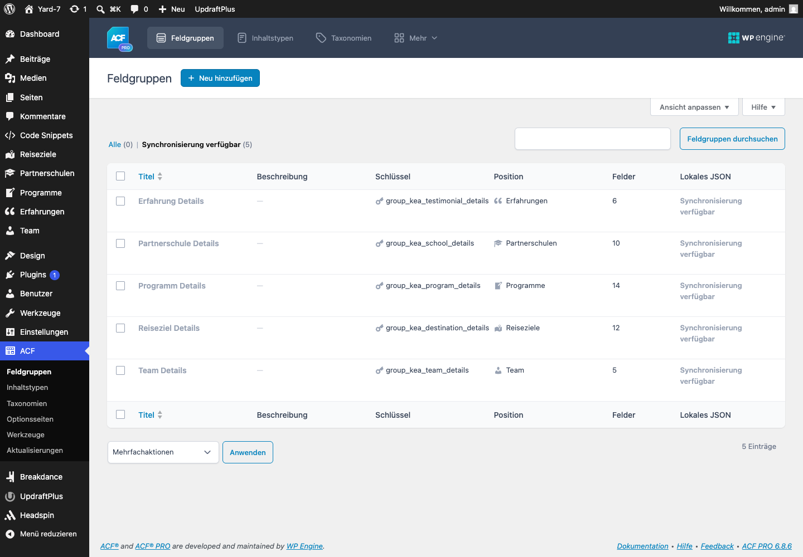
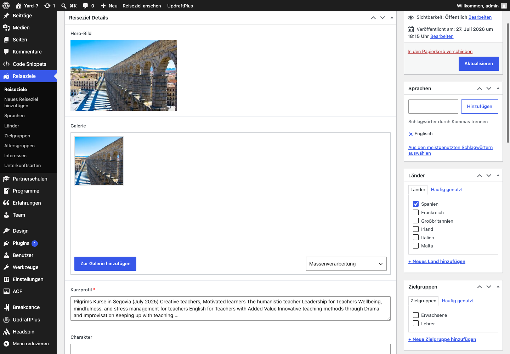
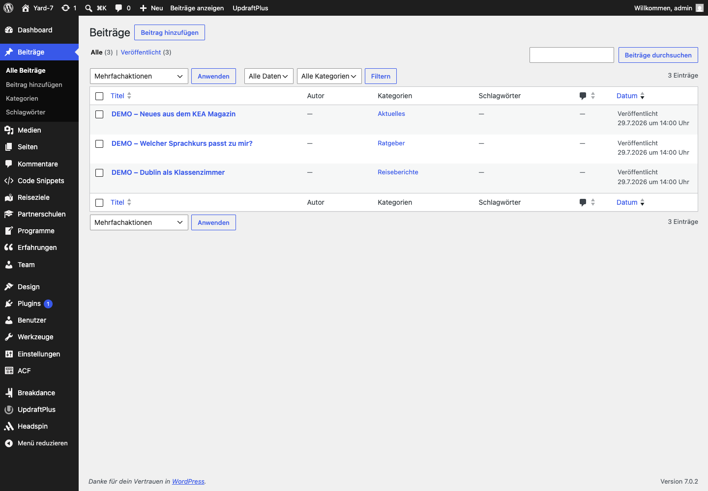
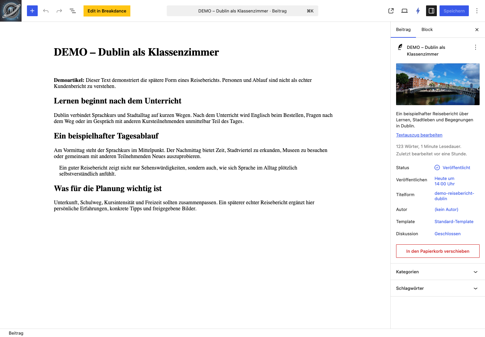
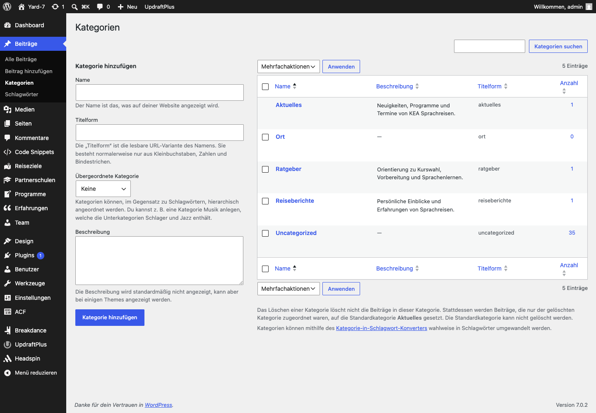

# Redaktions-Tutorial – KEA Sprachreisen

Dieses Dokument erklärt die laufende Pflege der dynamischen KEA-Inhalte. Grundregel: **ACF enthält die Inhalte, Breakdance gestaltet die Ausgabe.**

## 1. Wo wird was gepflegt?

| Aufgabe | Ort |
| --- | --- |
| Reiseziel, Partnerschule, Programm anlegen | WordPress-Backend |
| Texte, Fakten, Beziehungen, Bilder und FAQ | ACF-Felder am jeweiligen Datensatz |
| Überschriften, Beschriftungen, Farben, Abstände und Reihenfolge | Breakdance-Template |
| Globale Farben und Typografie | Headspin UI |

Keine individuelle Breakdance-Seite für Dublin, Barcelona oder eine einzelne Schule anlegen. Die Templates zeigen die Daten automatisch für alle passenden Datensätze.

### ACF Pro und Synchronisierung

**ACF Pro muss aktiv bleiben.** KEA Core ersetzt ACF nicht: Das Projektplugin registriert Inhaltstypen und stellt die versionierten Feldgruppen als Local JSON bereit. ACF Pro erzeugt daraus die Eingabemasken und stellt insbesondere die verwendeten Galerie- und Repeater-Felder bereit.

Nach einer Installation oder Aktualisierung kann unter **ACF → Feldgruppen** der Hinweis **„Synchronisierung verfügbar“** erscheinen. Die fünf KEA-Feldgruppen sind dann bereits aus dem Projektplugin geladen; es fehlen lediglich die bearbeitbaren Kopien in der WordPress-Datenbank.



Für die technische Synchronisierung:

1. **ACF → Feldgruppen → Synchronisierung verfügbar** öffnen.
2. Alle fünf KEA-Feldgruppen auswählen.
3. Unter **Mehrfachaktionen** die Aktion **Synchronisieren** wählen und anwenden.
4. Prüfen, dass Erfahrung, Partnerschule, Programm, Reiseziel und Team anschließend unter **Alle** erscheinen.

Redaktionelle Inhalte werden nicht in dieser Übersicht eingegeben, sondern direkt am jeweiligen Reiseziel, Programm, der Partnerschule, Erfahrung oder Person. Keine zweite Feldgruppe mit gleichem Zweck anlegen und technische Feldnamen wie `kea_destination_intro` nicht umbenennen.

ACF Free reicht für den aktuellen Stand nicht ohne Umbau: Die Reiseziel- und Schulgalerien sowie der FAQ-Repeater benötigen ACF Pro.

### Globale KEA-Farben

Pfad im Backend: **Headspin → Color schemas**. Die Palette wird dort zentral gepflegt: **Primary/Brand** ist das KEA-Grün, **Secondary** das zurückhaltende Blau und **Tertiary** der Coral-Akzent. Neutrale Flächen verwenden die warme Paper-/Sand-Skala. Farben nicht in einzelnen Breakdance-Elementen als Hexwerte ersetzen; sie übernehmen die Headspin-Tokens automatisch.

Die Standardbuttons, Links und Formular-Fokuszustände in Breakdance sind ebenfalls zentral mit diesen Tokens verbunden. Buttonfarben nicht pro Seite nachbauen; nur bewusst abweichende CTA-Varianten werden im jeweiligen Element gestaltet und müssen einen lesbaren Kontrast behalten.

## 2. Reiseziel pflegen

Pfad im Backend: **Reiseziele → Reiseziel bearbeiten**.



### ACF-Felder

| Feld | Verwendung im Template |
| --- | --- |
| Hero-Bild | Hero-Hintergrund |
| Galerie | Abschnitt „Eindrücke vor Ort“ |
| Kurzprofil | Hero-Text |
| Charakter | Abschnitt „Warum dieses Reiseziel?“ |
| KEA-Empfehlung | eigener redaktioneller Abschnitt |
| Beste Reisezeit | Faktenleiste |
| Mindestdauer | Faktenleiste |
| Hinweis zur Unterkunft | Faktenleiste und Inhaltsabschnitt |
| Hinweis zur Anreise | Faktenleiste und Inhaltsabschnitt |
| FAQ | aufklappbarer FAQ-Abschnitt |
| Empfohlene Partnerschulen/Programme | kuratierte Auswahl; die primäre Zuordnung bleibt an Schule bzw. Programm |

Leere Felder erzeugen keine leeren sichtbaren Bereiche.

### Empfohlene Reihenfolge

1. Titel, Land und Sprache prüfen.
2. Hero-Bild und Galerie in der Mediathek auswählen.
3. Kurzprofil und Charakter pflegen.
4. KEA-Empfehlung schreiben.
5. Fakten ergänzen.
6. Mindestens drei FAQ mit verbindlichen Antworten anlegen.
7. Aktualisieren und die öffentliche Seite prüfen.

## 3. Partnerschule pflegen

Pfad im Backend: **Partnerschulen → Partnerschule bearbeiten**.

| Feld | Verwendung im Template |
| --- | --- |
| Reiseziel | Pflichtbeziehung; bestimmt Land, Sprache und Kontext |
| Logo | im Profil-Hero |
| Galerie | Hero-Bild und Schulgalerie |
| Kurzprofil | Hero-Text |
| Hinweis zur Lage | Abschnitt „Lage“ |
| KEA-Einschätzung | eigener redaktioneller Abschnitt |
| Akkreditierungen | Faktenleiste |
| Durchschnittliche Gruppengröße | Faktenleiste |
| Mindestalter | Faktenleiste |
| Ausstattung | eigener redaktioneller Abschnitt |

Programme werden nicht an der Schule manuell aufgelistet. Jedes Programm wird im Programm-Datensatz dieser Schule zugeordnet und erscheint dann automatisch.

## 4. Programm pflegen

Pfad im Backend: **Programme → Programm bearbeiten**.

Pflicht sind Reiseziel, Partnerschule und Kurzprofil. Anschließend Kursart, Lektionen, Dauer, Sprachniveau, Mindestalter, Starttermine sowie Leistungen pflegen.

Preise nur veröffentlichen, wenn Betrag, Währung, Zeitraum und Preis-Hinweis fachlich geprüft sind. Historische Angaben sind keine aktuelle Zusage.

Das Programm-Template zeigt automatisch Hero, Kursfakten, Starttermine, enthaltene und nicht enthaltene Leistungen, Preis-Hinweis sowie Anfrage-CTA. Der CTA übernimmt Programm, Schule und Reiseziel automatisch in den Anfragekontext.

## 5. Bilder und Mediathek

1. Bild über die WordPress-Mediathek hochladen oder dort auswählen.
2. Aussagekräftigen Alternativtext eintragen.
3. Bildrechte und Aktualität prüfen.
4. Im jeweiligen ACF-Bild- oder Galerie-Feld auswählen.

Keine Bilder als feste URL oder Dateipfad in Breakdance eintragen. Hero-Bilder und Galerien kommen aus ACF, damit sie pro Datensatz austauschbar bleiben.

Im Reiseziel-Archiv zeigt ein Reiseziel ohne Hero-Bild automatisch eine vollflächige Textkarte statt einer leeren Bildfläche. Ein Hero-Bild bleibt dennoch empfohlen: Es ist zugleich das Bild für den Hero auf der Detailseite und die Archivkarte.

## 6. Erfahrungsbericht pflegen

Pfad im Backend: **Erfahrungen → Erfahrung bearbeiten**.

1. Einen eindeutigen internen Titel vergeben.
2. Name, Reiseziel, Reisejahr und Zitat im ACF-Bereich pflegen.
3. Optional ein Porträt über die Mediathek auswählen.
4. Nur mit Zustimmung der Person veröffentlichen; Namen bei Bedarf anonymisieren.

Die Erfahrung erscheint automatisch im Archiv **/erfahrungen/** und – wenn ein Reiseziel zugeordnet ist – auf dessen Detailseite. Der aktuell vorhandene Datensatz **„TEST – Erfahrungsbericht Dublin“** ist nur ein Test und muss vor dem Launch ersetzt oder gelöscht werden.

## 7. Teammitglied pflegen

Pfad im Backend: **Team → Teammitglied bearbeiten**.

1. Den Namen als Titel eintragen.
2. Funktion, E-Mail-Adresse und Telefonnummer pflegen.
3. Die gesprochenen Sprachen auswählen.
4. Im Kurzprofil Rolle, Beratungsschwerpunkte und persönliche Erfahrung knapp beschreiben.
5. Kontaktdaten prüfen und anschließend aktualisieren.

Teamdaten werden strukturiert gepflegt und nicht zusätzlich in Breakdance-Komponenten eingetragen. Persönliche Kontaktdaten nur mit Zustimmung veröffentlichen.

## 8. Breakdance-Editor richtig verwenden

Pfad: **Breakdance → Templates**. Für die Vorschau oben im Editor einen passenden Datensatz wählen, zum Beispiel **CES Dublin** oder **Barcelona**.

### Globale Navigation

Pfad: **Breakdance → Templates → Main Header**. Dieser Header erscheint auf der gesamten Website. Logo, die sieben Hauptpunkte, Suche und der Button **„Beratung starten →“** werden dort zentral gepflegt – niemals auf einer einzelnen Seite.

Die Reihenfolge lautet: Start, Sprachreisen, Reiseziele, Kurse, Warum KEA, Magazin, Kontakt. Der letzte Punkt ist bewusst der sichtbare Beratungs-CTA und führt zu **/anfrage/**. Bei einer Änderung stets Desktop und Mobilansicht prüfen; der Header bleibt über dem Hero ruhig und beim Scrollen erreichbar.

Über jedem KEA-Hero liegt der Header zunächst ohne Hintergrund; Navigation und Logo werden automatisch hell dargestellt. Sobald der Hero verlassen wird – sowie auf Archiven, Standardseiten und Seiten ohne Hero von Beginn an – erscheint eine dunkle Glasleiste, ebenfalls mit heller Navigation und hellem Logo. Nach 280 Pixeln blendet sie aus und erscheint beim Hochscrollen wieder. Das Logo muss nicht als zweite Datei gepflegt werden.

Standard-Unterseiten verwenden im Hero den hellen KEA-Hintergrund mit dunkler Schrift. Detailseiten für Reiseziele, Schulen und Programme verwenden weiterhin das redaktionell gepflegte Hero-Bild; dessen Verlauf wird zentral im dynamischen Hero-Element gesteuert. Diese Farben und Verläufe nicht pro Seite überschreiben.

Im Mobilmenü sitzt der Burger rechts. Das aufgeklappte Menü verwendet automatisch das KEA-Logo und nicht das Headspin-Logo. Die Links erscheinen im hellen Menü dunkel und verwenden den üblichen Handzeiger. Der aktive normale Menüpunkt erhält eine ruhige Hintergrundfläche statt einer Linie. Der Beratungs-CTA bleibt auch auf der aktiven Anfrageseite Coral und ohne Active-Linie. Beim Hover wird er dunkelgrün, nur der Tastaturfokus erhält zusätzlich eine sichtbare Kontur. Die feinen vertikalen Trenner bei Logo und Suche werden ebenfalls im Header-CSS gepflegt. Diese Regeln nicht auf einzelnen Seiten überschreiben.

#### Custom CSS: KEA-Logo und Leitsatz im Suchoverlay

Das native Breakdance-Element **Search Form** besitzt keinen eigenen Platz für Logo oder Leitsatz im Vollbild-Suchoverlay. Beides wird deshalb direkt am vorhandenen Suchformular über dessen elementbezogenes Custom CSS ergänzt.

Pfad: **Breakdance → Templates → Main Header → Edit in Breakdance → Suchsymbol/Search Form auswählen → Advanced → Custom CSS**.

1. Das Element **Search Form** im Header auswählen.
2. Den Reiter **Advanced** und darin **Custom CSS** öffnen.
3. Den folgenden Block am Ende des vorhandenen CSS einfügen. Bereits vorhandene Regeln nicht ersetzen.
4. Den Header speichern.
5. Im Frontend das Suchsymbol öffnen und Logo, Leitsatz, Suchfeld sowie Schließen-Symbol prüfen.

```css
%%SELECTOR%% {
  display: flex;
  align-items: center;
}

%%SELECTOR%% .search-form__button--full-screen {
  width: 2.5rem;
  height: 2.5rem;
  display: inline-flex;
  align-self: center;
  align-items: center;
  justify-content: center;
  flex: 0 0 2.5rem;
  padding: .6rem;
}

%%SELECTOR%% .search-form__lightbox::before {
  content: "";
  position: absolute;
  z-index: 20;
  top: clamp(2rem, 8vh, 5rem);
  left: 50%;
  width: clamp(8rem, 16vw, 12rem);
  aspect-ratio: 2 / 1;
  transform: translateX(-50%);
  background:
    url("/wp-content/uploads/2025/03/logo_KEA_V4_black.webp")
    center / contain no-repeat;
  filter: brightness(0) invert(1);
  pointer-events: none;
}

%%SELECTOR%% .search-form__lightbox::after {
  content: "Deine Reise. Dein nächstes Kapitel.";
  position: absolute;
  z-index: 20;
  top: clamp(9rem, 27vh, 15rem);
  left: 50%;
  width: min(90vw, 42rem);
  transform: translateX(-50%);
  color: var(--hcl-neutral-1);
  font-family: var(--hff-heading, serif);
  font-size: var(--hfs-h3);
  font-weight: 500;
  line-height: 1.15;
  letter-spacing: -.025em;
  text-align: center;
  pointer-events: none;
}

%%SELECTOR%% .search-form__lightbox-container {
  width: min(calc(100% - 2rem), 64rem) !important;
  max-width: 64rem;
  margin-inline: auto;
}
```

`%%SELECTOR%%` ist ein Breakdance-Platzhalter. Beim Speichern ersetzt Breakdance ihn automatisch durch den eindeutigen Selektor des ausgewählten Suchformulars. Die Regel wirkt dadurch nur auf dieses Element.

Die lokale schwarze Logo-Datei wird über `filter: brightness(0) invert(1)` im dunklen Overlay weiß dargestellt. Der Leitsatz wird über `::after` zwischen Logo und Suchleiste positioniert und verwendet die globale Editorial-Schrift. Die Container-Regel begrenzt das Suchfeld auf 64 rem und zentriert es im Overlay. Wird das Logo später in der Mediathek ersetzt, muss die URL in `background` ebenfalls angepasst werden. Logo und Leitsatz sind hier dekorativ und nicht anklickbar; Navigation und Suchfunktion bleiben unverändert.

**Main Header — Backup Editorial v1** ist die gesicherte vorherige Variante. Sie ist in Breakdance deaktiviert und wird nicht ausgeliefert. Erst diese Vorlage aktivieren, wenn der aktuelle Header ersetzt werden soll.

### Globaler Footer

Pfad: **Breakdance → Footers → Main Footer**. Der Footer erscheint auf der gesamten Website und bündelt die bestätigten KEA-Kontaktdaten, Reisebereiche, Service-Links, Social-Media-Profile und rechtlichen Links.

1. Logo, Kontaktdaten, Linktexte und Linkziele direkt im globalen Footer bearbeiten.
2. Für neue Reisebereiche oder Services vorhandene Link-Elemente duplizieren und das Ziel prüfen.
3. Externe Social-Media-Links in einem neuen Tab öffnen.
4. Nach Änderungen Desktop und Mobilansicht sowie Telefon-, E-Mail- und Tastaturbedienung prüfen.

Der Footer zeigt bewusst nur Telefonnummer und E-Mail-Adresse; die vollständige Firmenanschrift bleibt auf Kontakt- und Impressumsseite. Die Navigationslinks sind am Desktop als zwei ausgerichtete Spalten mit einzeiligen Linkzeilen gestaltet. Unterstreichungen oder eigene Farben nicht pro Link ergänzen.

Der Footer enthält keine reiseziel- oder programmbezogenen ACF-Inhalte. ACF bleibt für fachliche Datensätze zuständig; Breakdance pflegt hier ausschließlich die globale Darstellung und Navigation.

### Kontaktseite

Pfad: **Seiten → Kontakt → Mit Breakdance bearbeiten**. Die Seite zeigt die direkte Telefonnummer, E-Mail-Adresse und Firmenanschrift. Diese Angaben werden im Rich-Text-Element **„Direkter Kontakt“** gepflegt.

Die Kontaktseite enthält bewusst kein zweites Formular. Konkrete Reisewünsche führen über **„Beratung anfragen“** zur Anfrage-Seite; nur dort werden Formularfelder, Empfänger und Anfragekontext gepflegt. Dadurch bleiben allgemeiner Kontakt und qualifizierte Reiseanfrage klar getrennt.

### Impressum und Datenschutz

Pfade: **Seiten → Impressum** und **Seiten → Datenschutz**. Beide Seiten verwenden denselben eckigen Standardseitenaufbau mit Inhaltsnavigation und werden im jeweiligen Breakdance-Rich-Text gepflegt.

Betreiberangaben, Rechtsgrundlagen, Cookies, Dienstleister oder Empfänger nie nur im Footer ändern. Jede fachliche Änderung muss gleichzeitig auf der betreffenden Rechtseite und im internen [Datenschutzkonzept](datenschutz-konzept.md) geprüft werden. Neue Analyse-, Karten-, Video-, Captcha- oder Werbedienste dürfen nicht vor dieser Prüfung aktiviert werden.

Die WordPress-Datenschutzseite ist auf **Datenschutz** gesetzt. Das Anfrageformular verlinkt sie direkt im Pflichtfeld. Wird der Slug geändert, müssen Footer und Formularlink gemeinsam angepasst und getestet werden.

### Standard- und Zielgruppenseiten

Die Seiten **Sprachreisen**, **Kurse**, **Warum KEA**, **Über KEA**, **FAQ** sowie die fünf Zielgruppenseiten werden unter **Seiten** mit Breakdance gepflegt. Die Zielgruppenseiten liegen redaktionell unter **Sprachreisen**; diese Eltern-Kind-Struktur nicht auflösen, weil sie die URLs `/sprachreisen/.../` erzeugt.

Der Inhalt liegt jeweils in einem Rich-Text-Element mit Inhaltsnavigation, Karten und optionalem Schluss-CTA. Überschriften, Aussagen und Links können dort angepasst werden. Fachliche Reiseziele, Schulen und konkrete Programme werden weiterhin ausschließlich als strukturierte Datensätze gepflegt und nicht in diese Standardseiten kopiert.

### Magazin und Blog

Pfad im Backend: **Beiträge**. Die Seite **/magazin/** ist das automatische Beitragsarchiv und wird nicht mehr wie eine normale Breakdance-Seite mit einzelnen Artikeln befüllt.

#### Beiträge verwalten

Unter **Beiträge → Alle Beiträge** stehen Entwürfe und veröffentlichte Magazinartikel. Die drei mit **DEMO** markierten Artikel zeigen Aufbau und Kategorien und werden vor dem Launch ersetzt oder auf Entwurf gesetzt.



#### Magazinartikel erstellen oder bearbeiten

1. **Beiträge → Beitrag hinzufügen** öffnen oder in der Übersicht einen bestehenden Titel wählen.
2. Titel und Artikelinhalt im normalen WordPress-Editor pflegen.
3. In der rechten Seitenleiste einen kurzen Textauszug eintragen.
4. Ein Beitragsbild auswählen und dessen Alternativtext sowie Bildrechte prüfen.
5. Unter **Kategorien** genau eine passende Hauptkategorie wählen: **Ratgeber**, **Reiseberichte** oder **Aktuelles**.
6. Über **Vorschau** die öffentliche Darstellung prüfen.
7. Erst nach fachlicher Freigabe **Veröffentlichen** beziehungsweise **Speichern** wählen.



Der gelbe Button **„Edit in Breakdance“** wird für normale Artikel nicht verwendet. Breakdance gestaltet das gemeinsame Template **Single: Magazinartikel**; Titel, Text, Bild, Kurztext und Kategorie bleiben WordPress-Inhalte.

#### Kategorien pflegen

Unter **Beiträge → Kategorien** werden die Magazinbereiche verwaltet. Die Slugs `aktuelles`, `ratgeber` und `reiseberichte` nicht ändern, weil sie Bestandteil der Archiv-URLs sind. Neue Kategorien nur anlegen, wenn sie fachlich dauerhaft benötigt werden und anschließend im Magazin-Themenblock ergänzt werden.



Ohne bewusste Auswahl verwendet WordPress die Standardkategorie **Aktuelles**. **Uncategorized** und **Ort** gehören nicht zur sichtbaren KEA-Magazinstruktur und werden für neue Artikel nicht ausgewählt.

Der Kurztext erscheint auf der Archivkarte. Das Beitragsbild ist für jede Veröffentlichung erforderlich und wird im Magazinarchiv sowie im Artikeltemplate verwendet. Kommentare, Autorenbox, Newsletter und manuelle Seitenleisten sind nicht Teil des KEA-Magazins.

Artikel erhalten die URL **/magazin/{slug}/**. Kategorien liegen unter **/magazin/thema/{slug}/**. Je Kategorie ist ein veröffentlichter, im Titel und Inhalt klar markierter Demoartikel angelegt. Diese Beiträge dienen nur der Layoutprüfung und müssen vor dem Launch ersetzt oder auf Entwurf gesetzt werden.

### Was im Editor bearbeitet wird

- Abschnittsüberschriften und Feld-Beschriftungen
- CTA-Texte
- Farben
- Abstände, Layout und Reihenfolge

### Typografie in KEA-Elementen

Jedes KEA-Element hat im Reiter **Design → Typografie** eigene, responsive Einstellungen für seine sichtbaren Textrollen, etwa Kicker, Überschrift, Fließtext, Karten-Titel, Fakten oder CTA. Die Standardwerte verwenden die fluiden **Headspin-UI-Größen**; sie skalieren automatisch zwischen Mobilgerät und Desktop.

1. Im Breakdance-Editor das gewünschte KEA-Element anklicken.
2. **Design → Typografie** öffnen.
3. Die passende Textrolle öffnen und dort nur bei Bedarf Schriftgröße, Zeilenhöhe oder Schriftschnitt anpassen.
4. Desktop, Tablet und Mobilansicht prüfen und speichern.

Für neue Bereiche zuerst die vorhandenen Headspin-Standardwerte beibehalten. Keine festen Pixelgrößen als Ersatz für die fluiden Werte eintragen, außer es gibt einen konkreten, getesteten Gestaltungsgrund.

### Was nicht im Editor gepflegt wird

- Reisezeit, Mindestdauer, Lage, Einschätzung, FAQ oder andere fachliche Inhalte
- Bilder eines konkreten Reiseziels oder einer konkreten Schule
- Zuordnungen zwischen Reiseziel, Schule und Programm

Diese Werte kommen automatisch aus ACF. Bei eigenen dynamischen KEA-Elementen gibt es dafür kein Breakdance-Datenbank-Symbol; die ACF-Abfrage ist bereits im Element eingebaut.

### Ausgewählte Reiseziele auf der Startseite

Pfad: **Seiten → Home → Mit Breakdance bearbeiten → „Reisezielauswahl“**.

Der Bereich zeigt sechs ausgewählte Reiseziel-Datensätze dynamisch. Überschrift und Einleitung werden im Element gepflegt. Im Feld **Reiseziel-IDs** kann die Auswahl gezielt festgelegt werden; bleibt es leer, werden die veröffentlichten Reiseziele alphabetisch ausgegeben. Bild, Land, Sprache und Zielname werden immer am jeweiligen Reiseziel in ACF gepflegt.

Der Button unter dem Grid führt standardmäßig zu **/reiseziele/**. Im selben Element können **Button-Text** und **Button-URL** angepasst werden. Die vollständige Reiseziele-Seite ist ein dynamisches Archiv und zeigt automatisch alle veröffentlichten Reiseziele; dafür keine zweite manuelle Übersichtsseite anlegen.

Im Archive-Template zeigt das Element zusätzlich Filter für **Sprache** und **Land**. Die Begriffe kommen automatisch aus den Taxonomien **Sprachen** und **Länder**; sie werden also am jeweiligen Reiseziel gepflegt, nicht im Filter. Die Beschriftungen der Filter können im Element angepasst werden. Filter-URLs wie `/reiseziele/?language=englisch&country=irland` dürfen geteilt werden.

Wenn bei einem Profil-Fakten-Block links „Beste Reisezeit“ steht, ist das nur die **Beschriftung**. Der Inhalt „Juni–September“ wird im ACF-Feld gepflegt. Eine Änderung der Beschriftung im Editor muss die sichtbare Überschrift sofort ändern.

## 9. Aktueller Template-Stand

### Single: Reiseziel

Hero → Fakten → Inhalte → Partnerschulen → Programme → Galerie → Erfahrungen → FAQ → Anfrage-CTA

### Single: Partnerschule

Hero → Fakten → Lage/KEA-Einschätzung/Ausstattung → Programme → Galerie → Anfrage-CTA

### Single: Programm

Hero → Kursfakten → Starttermine/Leistungen/Preis-Hinweis → Anfrage-CTA

### Single: Magazinartikel

Hero mit Kategorie und Datum → Beitragsbild → Artikelinhalt → vorheriger/nächster Beitrag

### Archive

**Reiseziele**, **Programme**, **Erfahrungen** und das **Magazin** werden automatisch aus allen veröffentlichten Datensätzen beziehungsweise Beiträgen aufgebaut. Neue veröffentlichte Inhalte erscheinen ohne manuelle Breakdance-Übersichtsseite. Reihenfolge, Überschriften und Gestaltung werden im jeweiligen Archive-Template gepflegt.

Alle vorhandenen Bereiche sind dynamisch. Fehlen Daten, wird der jeweilige Bereich nicht ausgegeben.

### Suche und leere Ergebnisse

Pfad: **Breakdance → Templates → „Fallback: Search Results“**. Dort werden Kicker, Überschrift, Einleitung, neue Suche, Ergebnis-Karten und der Hinweis bei null Treffern gemeinsam gepflegt. Die Überschrift übernimmt automatisch den aktuellen WordPress-Suchbegriff. Der leere Zustand enthält eine eigene neue Suche sowie Links zu Reiseziele, Magazin und Kontakt.

Die Suche unterscheidet zwei Fälle:

- **Sammelbegriffe:** „Reiseziele“, „Partnerschulen“, „Programme“ und „Erfahrungen“ sowie ihre hinterlegten Singularformen zeigen alle veröffentlichten Einträge dieses Inhaltstyps alphabetisch.
- **Normale Suchbegriffe:** Namen und Themen wie „Dublin“ werden über die native WordPress-Suche in den öffentlichen Inhalten gesucht und dürfen gemischte Treffertypen liefern.

Diese Sammelbegriffe werden technisch im KEA-Core gepflegt, nicht im Breakdance-Template. Die Suche verwendet bewusst keine externe Such-Engine, keine automatische Rechtschreibkorrektur und keine unscharfe Trefferlogik.

Leere Reiseziel-Filter werden vom dynamischen Element **Destination List** ausgegeben. Text und Rücksetzlink entstehen aus den WordPress-Daten; nur die visuelle Darstellung wird im Element gepflegt. Keine zweite manuelle Leerzustands-Sektion anlegen.

### 404-Seite

Pfad: **Breakdance → Templates → „404 Not Found“ → „KEA-Hero“**. Kicker, Überschrift, Text und beide Buttons werden direkt im Breakdance-Editor gepflegt. Die Seite erscheint automatisch bei nicht vorhandenen URLs; keine WordPress-Seite dafür anlegen.

## 10. Prüfen vor dem Veröffentlichen

- Desktop- und Mobilansicht kontrollieren.
- Keine leeren Abschnitte sichtbar.
- CTA führt mit richtigem Reiseziel- bzw. Schulkontext zu `/anfrage/`.
- Bilder haben passende Alt-Texte und gesicherte Rechte.
- Programme und Schulen sind fachlich noch aktuell.
- Preis-, Termin- und Verfügbarkeitsangaben sind geprüft.

## 11. Anfrageformular

Pfad: **Seiten → Anfrage → Mit Breakdance bearbeiten**.

Das Formular ist ein nativer **Breakdance Form Builder**. Namen, Feldbeschriftungen, Pflichtfelder, Button, Meldungen, E-Mail-Empfänger und Formulardesign werden direkt im Element gepflegt. Neue Anfragen werden zusätzlich unter **Breakdance → Form Submissions** gespeichert.

Container, Eingabefelder, Checkboxen, Meldungen und Absende-Button folgen dem eckigen KEA-Stil. Fokuszustände und Feldgrenzen sind bewusst kontrastreich. Ungültige Pflichtfelder werden erst nach Interaktion oder Absendeversuch farblich markiert; Erfolgs- und Fehlermeldungen verwenden die zentralen Headspin-Farben. Radios bleiben rund, damit sie eindeutig von Checkboxen unterscheidbar sind. Diese Zustände nicht pro Feld überschreiben.

Die sichtbaren Auswahlfelder für Reiseform, Anfragetyp, Reiseziel und Programm/Kurswunsch gehören ebenfalls zum Form-Builder-Element. Die Optionen können dort direkt ergänzt, umsortiert oder entfernt werden. Reiseziel und Programm sind bewusst optional: Kommt eine Person über einen CTA auf einer Detailseite, wird der passende Kontext bereits unsichtbar und verlässlich übernommen.

Die Anfrage-CTAs auf Reiseziele, Schulen und Programmen übergeben ihren Kontext automatisch. Die drei unsichtbaren Felder **destination**, **school** und **program** dürfen nicht entfernt oder umbenannt werden; sie sorgen dafür, dass die Beratung weiß, worauf sich die Anfrage bezieht. Ungültige oder nicht veröffentlichte Werte werden beim Absenden abgewiesen.

Vor dem Livegang müssen Empfängeradresse, Absenderadresse, SMTP-Versand und Datenschutztext im Formular final geprüft werden. Eine Formular-E-Mail ist erst nach einer echten Testanfrage als abgenommen zu betrachten.

## 12. Bekannte redaktionelle Restarbeit

Für Reiseziele fehlen derzeit insbesondere Charakter, KEA-Empfehlung, Fakten und FAQ. Details stehen in [todo.md](todo.md).

## 13. Technischer Hinweis für Template-Pflege

Breakdance-Template-Daten werden technisch über das Projekt gepflegt. Änderungen am Template-Speicherformat dürfen nur über die native Breakdance-Datenfunktion erfolgen. Nach technischen Template-Änderungen werden Cache, Zielseite und Template-Manager geprüft.

## 14. SEO und Social-Media-Vorschau (KEA Core SEO)

Das Projektplugin `kea-core` enthält ein automatisches, leichtgewichtiges SEO-Modul. Es erzeugt ohne schweres Zusatz-Plugin schlanke Meta-Beschreibungen (Meta Descriptions), Open-Graph-Tags für Facebook/WhatsApp/LinkedIn und Twitter Cards direkt im Seitenkopf (`<head>`).

### Wie entsteht die Meta-Description?

Die Meta-Description für Suchmaschinen wird automatisch anhand der redaktionellen Inhalte ermittelt (geprüfte Länge: max. 155 Zeichen):

1. **Startseite:** Fest hinterlegter KEA-Leitsatz (*„Persönlich ausgewählte Sprachreisen für Erwachsene, Schüler, Lehrer und Unternehmen...“*).
2. **Reiseziele, Partnerschulen & Programme:** Die Auswertung liest vorrangig das jeweilige ACF-Intro-Feld (`kea_destination_intro`, `kea_school_intro`, `kea_program_intro`). Fehlt dieses, wird der Beitrags-Auszug (*Excerpt*) oder der erste Absatz des Fließtexts verwendet.
3. **Magazinartikel & Seiten:** Verwendet bevorzugt den manuell eingetragenen **Auszug** (*Excerpt*) in der rechten Seitenleiste des Editors. Fehlt der Auszug, wird der Text des Beitrags bereinigt übernommen.
4. **Archivseiten (Reiseziele, Programme, Schulen, Kategorien):** Liest die Beschreibung der jeweiligen Taxonomie oder Kategorie aus.

### Wie entsteht das Social-Media-Vorschaubild (Open Graph / Twitter)?

Wenn ein Link auf WhatsApp, Facebook, LinkedIn oder X/Twitter geteilt wird, wählt KEA Core automatisch das beste Vorschaubild:

1. **Beitragsbild (Featured Image):** Bei Beitrags- und Seiten-Datensätzen wird primär das festgelegte Beitragsbild verwendet.
2. **Hero-Bild (ACF):** Bei Reisezielen und CPTs greift das Modul auf das im ACF-Feld `kea_destination_hero_image` hinterlegte Bild zurück.

### Empfehlungen für die Redaktion

* **Kurztext/Auszug pflegen:** Bei jedem neuen Magazinartikel oder Reiseziel 1–2 knackige Sätze im Auszug oder im ACF-Kurzprofil eintragen. Das sorgt für transparente Vorschautexte auf Google.
* **Aussagekräftiges Beitrags- bzw. Hero-Bild wählen:** Für jedes Reiseziel und jeden Artikel ein hochauflösendes Bild im Format 16:9 oder 3:2 hinterlegen, damit das Teilen in sozialen Netzwerken ansprechend aussieht.

